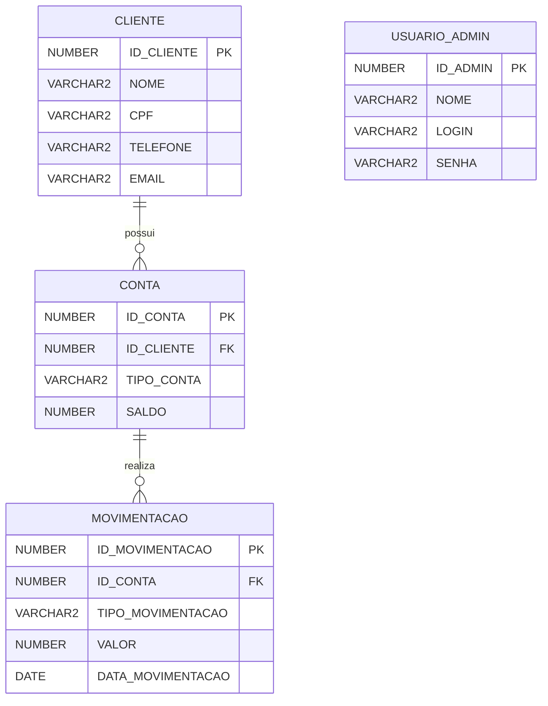

# Sistema-bancario-oracle
Projeto Disciplina de Banco de Dados Uninassau

# Diagrama Entidade Relacionamento (DER)

```mermaid
erDiagram

    CLIENTE {
        NUMBER ID_CLIENTE PK
        VARCHAR2 NOME
        VARCHAR2 CPF
        VARCHAR2 TELEFONE
        VARCHAR2 EMAIL
    }

    CONTA {
        NUMBER ID_CONTA PK
        NUMBER ID_CLIENTE FK
        VARCHAR2 TIPO_CONTA
        NUMBER SALDO
    }

    MOVIMENTACAO {
        NUMBER ID_MOVIMENTACAO PK
        NUMBER ID_CONTA FK
        VARCHAR2 TIPO_MOVIMENTACAO
        NUMBER VALOR
        DATE DATA_MOVIMENTACAO
    }

    USUARIO_ADMIN {
        NUMBER ID_ADMIN PK
        VARCHAR2 NOME
        VARCHAR2 LOGIN
        VARCHAR2 SENHA
    }
 ```

    CLIENTE ||--o{ CONTA : possui
    CONTA ||--o{ MOVIMENTACAO : realiza
```
